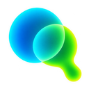
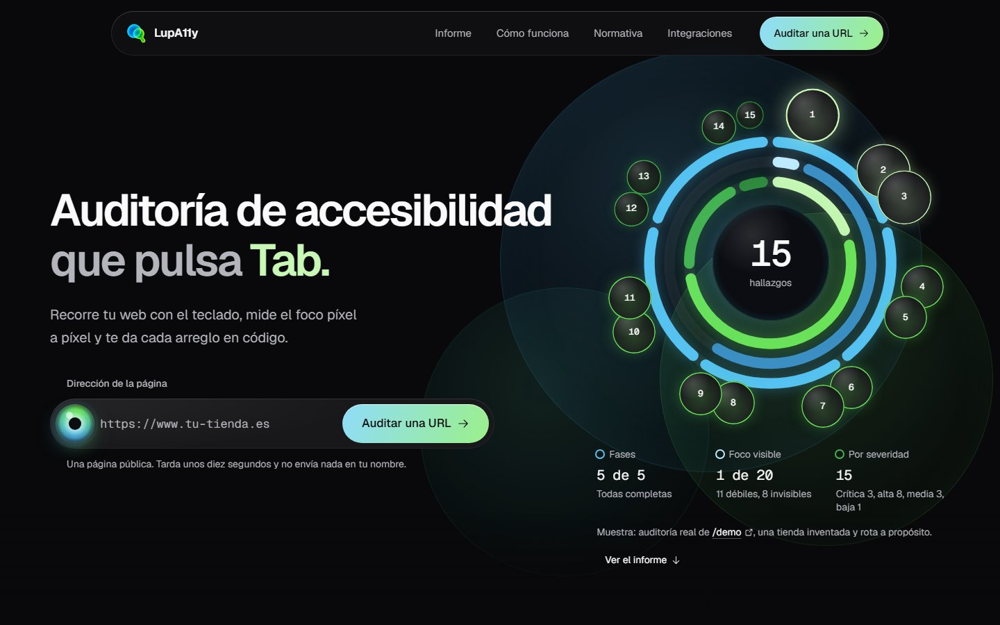
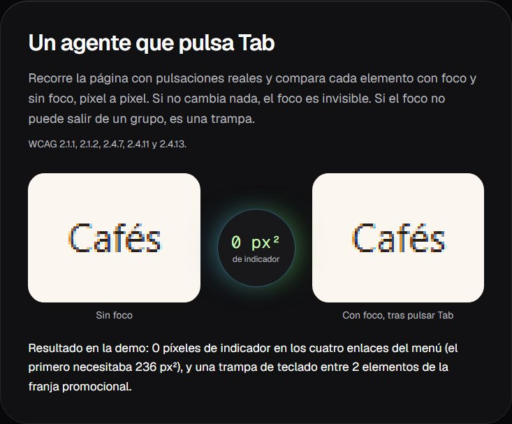
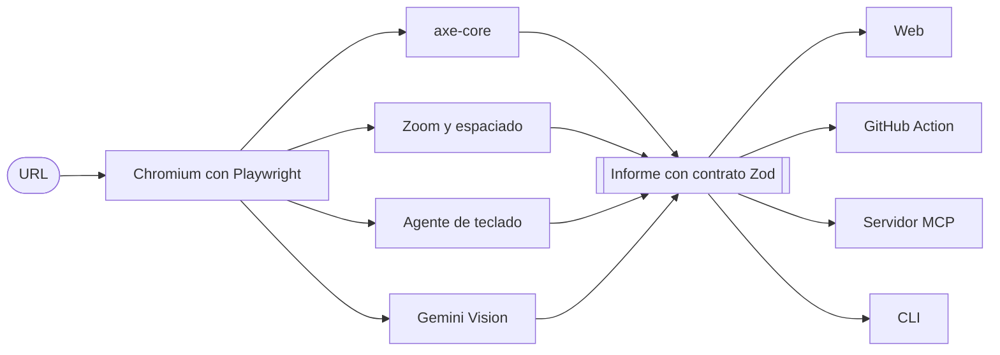

<div align="center">



# LupA11y

*Agentic Accessibility Auditing: Deterministic Precision meets Visual Intelligence.*

**Auditoría de accesibilidad que pulsa Tab.**<br>
Recorre tu web con el teclado, mide el foco píxel a píxel y te da cada arreglo en código.

[](https://github.com/Adriiiii24/LUPA11Y/actions/workflows/ci.yml)
[](https://github.com/Adriiiii24/LUPA11Y/releases/latest)
[](https://www.w3.org/TR/WCAG22/)
[](LICENSE)

**[Pruébalo en directo en lupa11y.vercel.app →](https://lupa11y.vercel.app)**

</div>

<br>

[](https://lupa11y.vercel.app)

> [!NOTE]
> El Acta Europea de Accesibilidad (Directiva (UE) 2019/882, Ley 11/2023 en España) se aplica desde el 28 de junio de 2025. LupA11y no certifica el cumplimiento: enseña la evidencia y los arreglos.

## Qué detecta

Cuatro fases sobre un Chromium real. Primero se mide; el modelo solo entra donde ninguna regla puede decidir.

| Fase | Qué comprueba | WCAG |
| --- | --- | --- |
| **axe-core** | Las reglas automáticas de WCAG dentro de Chromium (Playwright), con los mensajes en español. | 2.2 A y AA |
| **Zoom y espaciado** | La página a 320 px de ancho (un zoom del 400 %) y con el espaciado de texto de WCAG. Mide qué bloques obligan a desplazarse en horizontal y qué textos quedan recortados. | 1.4.10, 1.4.12 |
| **Agente de teclado** | Pulsa `Tab` de verdad, traza el orden del foco y compara cada elemento con y sin foco, píxel a píxel. Detecta focos invisibles o tapados por capas fijas, trampas de teclado y controles que no responden a `Enter`. El rol y el nombre de cada parada salen del árbol de accesibilidad de Chromium: lo que anuncia un lector de pantalla. | 2.1.1, 2.1.2, 2.4.7, 2.4.11, 2.4.12, 2.4.13 |
| **Gemini Vision** | Si el `alt` dice la verdad y si un foco débil se percibe. Trabaja en paralelo con el agente de teclado y es opcional: sin clave, el informe la marca como omitida. | 1.1.1, 2.4.7 |

## Cada hallazgo, con su evidencia

[](https://lupa11y.vercel.app/#informe)

Cada hallazgo dice de qué fase sale, qué criterio WCAG incumple y con qué severidad. Trae el selector, el fragmento de HTML, el recorte de la captura (la lupa lo señala sobre la página) y un diff de corrección listo para copiar. El informe se descarga en JSON o en SARIF y se copia en Markdown.



El agente no adivina si el foco se ve: lo mide. En la demo, los cuatro enlaces del menú cambian 0 píxeles al recibir el foco, cuando el primero necesitaba 236 px².

## Cuatro formas de usarlo

Las cuatro llaman al mismo motor y devuelven el mismo contrato Zod.

### En la web

Pega una URL pública en [lupa11y.vercel.app](https://lupa11y.vercel.app). La captura y los hallazgos llegan fase a fase mientras se audita, en unos diez segundos.

### En tu CI, con la GitHub Action

```yaml
- uses: Adriiiii24/LupA11y@v0
  with:
    url: http://localhost:3000
    fail-on: high
    sarif-path: lupa11y.sarif
    comment-pr: true              # necesita permissions: pull-requests: write
    gemini-api-key: ${{ secrets.GEMINI_API_KEY }}
- uses: github/codeql-action/upload-sarif@v4
  if: always()
  with:
    sarif_file: lupa11y.sarif     # necesita permissions: security-events: write
```

Falla el check por encima de la severidad que elijas. Deja el resumen con los diffs en el job, anotaciones, un comentario en la pull request y SARIF para la pestaña de seguridad. Admite varias URL, un `sitemap` con `max-pages`, una `baseline` para fallar solo por lo que es nuevo o empeora, y `level`. Cachea Chromium entre ejecuciones y solo instala Node si el del job no sirve.

### En tu editor, con el servidor MCP

```bash
claude mcp add lupa11y -e GEMINI_API_KEY=tu_clave -- node /ruta/a/LupA11y/packages/mcp/src/server.ts
```

La herramienta `audit_url` acepta `localhost` y devuelve Markdown con los diffs y un resumen estructurado (`structuredContent`). Está pensada para el bucle «audita, aplica, vuelve a auditar»: mantiene Chromium arrancado entre llamadas y la segunda auditoría de la misma URL dice qué se arregló, qué es nuevo y qué sigue igual. Funciona en Claude Code, Cursor y cualquier cliente MCP por stdio.

### En la terminal, con la CLI

```bash
node packages/cli/src/main.ts https://www.tu-tienda.es --fail-on high --out informe.json --summary resumen.md
```

| Opción | Para qué |
| --- | --- |
| `<url...>` y `--sitemap <url>` | Una o varias páginas, o las de un sitemap (con `--max-pages`, 10 por defecto). Con varias, el JSON es un lote. |
| `--baseline <informe.json>` | Solo falla por lo que es nuevo o empeora respecto a ese informe. Las fases que no corrieron en los dos no se comparan. |
| `--sarif <ruta>` | SARIF 2.1.0 para el escaneo de código de GitHub, con huellas estables entre ejecuciones. |
| `--storage-state <ruta>` y `--header "Nombre: valor"` | Páginas tras el login. Las cabeceras solo viajan al origen auditado, nunca a terceros. |
| `--no-vision`, `--no-keyboard`, `--no-layout` | Omiten una fase. |

Códigos de salida: `0` sin hallazgos por encima del umbral, `1` con hallazgos y `2` si alguna auditoría falló.

## Cómo funciona



- **Un motor, un contrato.** `packages/core` hace la auditoría y la valida con un esquema Zod; las cuatro salidas solo cambian cómo la presentan.
- **En directo.** La API emite la auditoría como NDJSON: la consola de la web pinta eventos reales, no una animación.
- **Comparable.** Cada nodo tiene una huella estable, así que dos auditorías se comparan hallazgo a hallazgo (línea base en la CI y memoria en el MCP).

La arquitectura completa (el algoritmo del agente, la medición del foco, la política de red, la comparación y las pruebas) está en [docs/ARCHITECTURE.md](docs/ARCHITECTURE.md).

## Seguridad

- La API pública solo audita hosts públicos. Se comprueban la URL, cada petición del navegador, cada WebSocket y cada salto de redirección.
- En modo público, Chromium no resuelve DNS: sale por un proxy local que resuelve cada host una vez, lo valida y se conecta a esa misma IP. Así no cabe un *DNS rebinding*. WebRTC solo puede salir por el proxy.
- La cuota solo se fía de la IP que declare un proxy de confianza; además hay un presupuesto global por proceso.
- Los errores internos no llegan al cliente público: se registran en el servidor y el usuario ve un mensaje genérico.
- El agente de teclado trabaja en modo de solo lectura: no envía formularios ni navega.
- El contenido de la página llega a Gemini como dato delimitado, y la respuesta solo puede ser el JSON del esquema.

## Desarrollo

<details>
<summary><strong>Puesta en marcha en local</strong></summary>

Requisitos: Node 24.11 o superior.

```bash
npm install
npx playwright install chromium
npm run dev              # http://localhost:3000
```

La fase de visión se activa con `GEMINI_API_KEY` en `apps/web/.env.local`. Sin ella, todo lo demás funciona y el informe marca la visión como omitida. Con una clave gratuita de Google AI Studio también funciona: el motor respeta sus límites por minuto, reintenta si el modelo está saturado y puede seguir con un modelo de reserva cuando el principal agota su cuota diaria (unas 20 consultas al día por modelo; cada auditoría hace hasta 14). Las demás variables (cuota, IP de confianza, enlaces permanentes) están explicadas en [`apps/web/.env.example`](apps/web/.env.example).

| Comando | Qué hace |
| --- | --- |
| `npm test` | Tests unitarios y de extremo a extremo del motor, la CLI, el MCP y la lógica de la web, con `node --test` |
| `npm run test:web` | La web de verdad (necesita `npm run build`): auditoría en directo, enlace guardado, axe sobre la propia interfaz y la función de Vercel con solo sus ficheros trazados |
| `npm run typecheck` | `tsc` estricto en los cuatro paquetes |
| `npm run lint` | ESLint de la web |
| `npm run build` | Build de producción de la web |
| `npm run audit -- <url>` | La CLI |
| `npm run sample` | Regenera la auditoría de muestra de la landing a partir de `/demo` |
| `npm run pack:packages` | Compila los paquetes a JavaScript, los empaqueta y comprueba que se instalan y arrancan |

</details>

<details>
<summary><strong>Despliegue</strong></summary>

En **Vercel** (plan gratuito) basta con importar el repositorio: [`vercel.json`](vercel.json) declara un único servicio, la web de `apps/web`, instalada desde la raíz del monorepo. La landing se sirve estática y la API usa el Chromium de `@sparticuz/chromium`. Allí los enlaces permanentes quedan desactivados, porque el disco no persiste.

El [`Dockerfile`](Dockerfile) construye la web con su Chromium para un contenedor de larga vida (Fly.io, Cloud Run, un VPS…), en modo `public-only` y con un volumen en `/data` para los enlaces permanentes.

</details>

<details>
<summary><strong>Paquetes de npm</strong></summary>

`npm run pack:packages` deja en `.pack/` los tres paquetes compilados (`@lupa11y/core`, `@lupa11y/cli` con el binario `lupa11y`, `@lupa11y/mcp` con `lupa11y-mcp`) y verifica que se instalan desde sus tarballs y arrancan. Publicarlos es `npm publish .pack/<paquete>`.

</details>

<details>
<summary><strong>Versiones</strong></summary>

Los cambios de cada versión están en [CHANGELOG.md](CHANGELOG.md). La Action se usa por su etiqueta mayor, `@v0`, que se mueve a cada versión 0.x:

```bash
git tag vX.Y.Z && git push origin vX.Y.Z
git tag -f v0 vX.Y.Z && git push -f origin v0
```

</details>

<details>
<summary><strong>Estructura del repositorio</strong></summary>

```text
packages/core   motor + contrato Zod (schema.ts) + textos (format.ts) + comparación (compare.ts) + SARIF (sarif.ts)
packages/cli    CLI y base de la GitHub Action
packages/mcp    servidor MCP (stdio)
apps/web        landing y visor en Next.js 16, API de streaming NDJSON, informes compartidos, demo rota a propósito
action.yml      GitHub Action compuesta
scripts/        empaquetado para npm
docs/           ARCHITECTURE.md y las capturas de este README
```

</details>

---

<div align="center">

[Arquitectura](docs/ARCHITECTURE.md) · [Producto](PRODUCT.md) · [Cambios](CHANGELOG.md) · [Licencia MIT](LICENSE)

Proyecto de portfolio de **Adrián Martínez Panés**.

</div>
