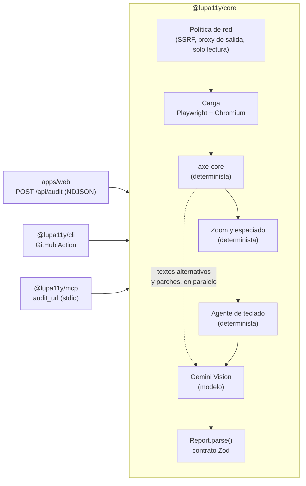

# Arquitectura de LupA11y

> Versión 2.0 · 2026-10-04. Describe el código tal y como está en el repositorio; si cambia el código, se actualiza este documento.

## 1. Vista general

Hay un motor y cuatro salidas. Ninguna salida reimplementa nada del motor, y todas hablan el mismo contrato Zod.



| Paquete | Qué contiene | Dependencias |
| --- | --- | --- |
| `packages/core` | motor, contrato (`schema.ts`), textos (`format.ts`), comparación (`compare.ts`), SARIF (`sarif.ts`), proxy de salida y pool de navegadores | playwright, @axe-core/playwright, axe-core, @google/genai, zod |
| `packages/cli` | CLI con umbral, línea base, varias páginas, sitemap, SARIF y resumen en Markdown | core |
| `packages/mcp` | servidor MCP por stdio con la herramienta `audit_url` | core, @modelcontextprotocol/sdk, zod |
| `apps/web` | landing, visor, API de streaming e informes compartidos | core, next, react, motion |
| `action.yml` | GitHub Action compuesta que ejecuta la CLI | — |

En el monorepo los paquetes se consumen como TypeScript fuente: Node 24 elimina los tipos al ejecutar (*type stripping*) y Next los transpila con `transpilePackages`. Por eso `tsconfig` exige `erasableSyntaxOnly`: nada de `enum`, `namespace` ni propiedades de parámetro. Para publicarlos se compilan (sección 9).

`@lupa11y/core/schema`, `/format`, `/compare` y `/sarif` no importan nada del motor. El cliente web los usa sin arrastrar Playwright al bundle.

## 2. El contrato

`packages/core/src/schema.ts` es la única definición de tipos del informe. Versión 2.

- **`Report`**: metadatos, fases con su estado y duración, resumen por severidad y fuente, captura de página completa, mapa de teclado y hallazgos.
- **`Finding`**: una regla (`source:rule`) con sus nodos afectados (hasta 6, más `occurrences` con el total). Cada nodo lleva el selector, el HTML, la caja en coordenadas de documento, la evidencia (un recorte o el par sin foco / con foco) y un `Fix` con su diff unificado y su `origin`: `deterministic` o `model`.
- **`AuditBatch`**: varias páginas de una misma ejecución de la CLI.
- **`AuditEvent`**: la unión discriminada que circula por el stream: `phase`, `log`, `capture` (la captura, en cuanto carga la página), `partial` (los hallazgos de una fase recién cerrada, sin imágenes), `result`, `saved` (el enlace permanente) y `error`.

El motor valida su propia salida con `Report.parse` antes de devolverla. El cliente web vuelve a validar cada línea del stream con `AuditEvent.safeParse`. `parseReport` lee también informes de la versión 1 (sin la fuente `layout`) y los migra; así una línea base antigua sigue sirviendo.

## 3. Fases

### Carga

Arranca Chromium headless con un contexto limpio: viewport de 1280×800, `deviceScaleFactor` 1, service workers y descargas bloqueados, y si se pidió, la sesión (`storageState`) y las cabeceras del origen auditado. Espera a `networkidle`, recorre la página una vez para que carguen las imágenes diferidas y hace la captura de página completa (JPEG, hasta 6000 px de alto), que emite enseguida como evento `capture`. Es la única fase fatal.

### axe-core

Ejecuta `@axe-core/playwright` con el locale español inyectado en el propio `axeSource`, porque `AxeBuilder` no expone `configure`. Usa las etiquetas `wcag2a`, `wcag2aa`, `wcag21a`, `wcag21aa`, `wcag22aa` y `best-practice`, más las de AAA si se pide ese nivel.

- **Severidad:** `critical → critical`, `serious → high`, `moderate → medium`, `minor → low`.
- **WCAG:** los criterios salen de las etiquetas (`wcag143` → 1.4.3) y el nivel, de `wcag2aa` y similares.
- **Recortes sin desplazar la página:** las cajas ya están en coordenadas de documento y Chromium captura más allá de la ventana, así que cada recorte es una sola captura y una cabecera fija nunca tapa el elemento.
- **Arreglo de contraste, determinista:** axe da el color de primer plano, el de fondo y la ratio exigida. El motor busca en OKLCH el color con la **misma tonalidad y el menor cambio de luminosidad** que alcanza la ratio, probando a oscurecer y a aclarar. Si el color sale de sRGB, reduce el croma lo justo.

### Zoom y espaciado

Lo que pasa cuando alguien amplía la página o separa el texto. Cambia la ventana y añade una hoja de estilos, y al terminar deja las dos como estaban, pase lo que pase.

- **WCAG 1.4.10, reflujo.** La ventana pasa a 320 px de ancho (un zoom del 400 % sobre 1280 px). Se buscan los elementos que se salen por los lados, salvo lo que la norma exceptúa (tablas, código, vídeo, mapas, contenido con su propio desplazamiento horizontal). Se agrupan por el bloque del que se salen, que es donde va el arreglo, y para cada bloque se propone un CSS según su tipo: `flex-wrap: wrap` para una fila flex, una rejilla `auto-fit` para un grid y `max-width: 100%` para el resto. El recorte enseña el bloque a 320 px con lo que se sale. Las cajas se vuelven a medir en el diseño normal para pintarlas sobre la captura de 1280 px.
- **WCAG 1.4.12, espaciado del texto.** Se aplica, como hoja adoptada (no depende de la CSP de la página), el espaciado del marcador de prueba de WCAG: interlineado 1,5, letras a 0,12 em, palabras a 0,16 em y párrafos a 2 em. Se mide el propio texto: los recuadros de línea que quedan fuera de una caja con `overflow: hidden` o `clip`. Solo cuenta el texto que el espaciado recorta y la página no recortaba ya; lo que se puede desplazar no se pierde, y una imagen decorativa que se sale no es texto.

### Agente de teclado

```text
blur + scroll arriba · modo solo lectura
repetir hasta 60 veces:
  Tab
  activo = elemento activo real (atraviesa shadow roots e iframes, también de otro origen)
  si no hay activo  → el foco salió del documento: CICLO CERRADO
  si activo ya visto (por identidad, no por selector) → BUCLE
       dentro de un diálogo modal → comportamiento esperado
       si Escape o Shift+Tab lo sacan → bucle con salida
       si no → TRAMPA (2.1.2)
  rol y nombre = árbol de accesibilidad de Chromium (CDP)
  medir foco:
       si el aro no cabe en la ventana → desplazar lo justo
       recorte con foco → blur → recorte sin foco → devolver el foco → devolver el scroll
       comparar píxeles en paralelo, mientras sigue el recorrido
  oclusión: elementFromPoint en 5 puntos → none / partial / full (2.4.11)
después: Enter o Espacio sobre los mismos nodos no nativos → ¿cambia algo? (2.1.1)
```

Decisiones no obvias:

- **Identidad de cada parada.** Un id que vive en la propia página (un `WeakMap` por documento) y no el selector: una clase de estado o un hermano nuevo cambian el selector, pero no el nodo. Los controles que luego se prueban con Enter se conservan como `ElementHandle`, sin volver a buscarlos.
- **Rol y nombre reales.** Se leen del árbol de accesibilidad de Chromium con `Accessibility.getPartialAXTree`: lo que anuncia un lector de pantalla, con el cálculo del nombre accesible completo. Dentro de iframes vale la aproximación del runtime.
- **Devolver el foco tras el blur.** Sin eso, el siguiente Tab lo recibe `<body>` y los manejadores de teclado del componente no se ejecutan nunca. Las trampas de foco hechas con `keydown` pasarían desapercibidas.
- **Medición del foco (WCAG 2.4.13).** Se cuentan los píxeles que cambian al menos 3:1 entre el estado con foco y sin foco, y se comparan con el área de un perímetro de 2 px (`4 × (ancho + alto)`). La comparación corre en un canvas dentro de una página en blanco de otro contexto, en paralelo con el recorrido. Si el navegador dejó el elemento pegado al borde, la ventana se desplaza lo justo para recortar con margen y después vuelve a su sitio: la parada siguiente llega con el mismo desplazamiento que vería una persona.
  - Sin cambios perceptibles: foco **invisible** (falla 2.4.7, AA).
  - Por debajo de la mitad del área: **ambiguo**, lo decide la visión.
  - Entre la mitad y el área completa: se ve, pero no llega a AAA.
- **Controles ocultos visualmente.** Si el elemento con foco mide menos de 4 px (un radio de 1 px dentro de una `<label>` estilizada), se mide su etiqueta, que es donde se pinta el foco.

El recorrido corre en **modo de solo lectura**: se abortan las peticiones que no son GET, HEAD u OPTIONS y cualquier navegación. El agente nunca envía un formulario ni sale de la página.

### Gemini Vision

Solo se ejecuta si hay `GEMINI_API_KEY`. Si no, se marca como omitida y el informe sigue siendo válido. Son tres tareas puras: devuelven hallazgos y parches, no tocan los hallazgos de otras fases (el orquestador aplica los parches al final). Comparten un límite de 4 llamadas en vuelo y un máximo de 14 por auditoría.

1. **Textos alternativos.** Recibe la imagen, su alt y el contexto (pie de figura, encabezado anterior, texto del bloque y si es un enlace). Devuelve un veredicto `accurate`, `incomplete`, `wrong` o `decorative`, un alt propuesto y su confianza. Si falta el alt, la propuesta se convierte en el arreglo del hallazgo `image-alt` de axe. Un `alt=""` que el modelo ve decorativo es lo correcto y no genera hallazgo.
2. **Focos ambiguos.** Recibe el par sin foco / con foco y la medición, y responde si una persona lo percibe.
3. **Parches HTML.** Una sola llamada por lotes para los hallazgos de axe sin arreglo calculado. Solo se acepta un parche si conserva la etiqueta de apertura.

Las tareas 1 y 3 solo dependen de axe: salen hacia el modelo en cuanto axe termina y trabajan mientras corren el zoom y el teclado. Solo la 2 espera al agente.

Todas las respuestas usan salida estructurada (`responseJsonSchema`, generado con `z.toJSONSchema`) y se validan con Zod. **Inyección de prompt:** el texto de la página va entre etiquetas `<dato>` y la instrucción de sistema lo declara no confiable. Además, la respuesta solo puede ser el JSON del esquema.

**Cuota y saturación** (pensado también para el plan gratuito de Google AI Studio, con unas 20 consultas al día y pocas por minuto, por modelo). El cliente lee el error de Google: estado HTTP, tipo de cuota (`quotaId`), límite (`quotaValue`) y espera (`RetryInfo.retryDelay`).

- **Límite por minuto (429):** espera lo que pide Google, pasa a consultas de una en una a un ritmo prudente y reintenta. Con `LUPA11Y_VISION_RPM` se fija un ritmo para no llegar a chocar.
- **Modelo saturado (5xx, «high demand»):** reintenta con esperas crecientes.
- **Cuota diaria agotada o modelo inexistente:** si hay modelo de reserva (`LUPA11Y_VISION_FALLBACK_MODEL`), sigue con él; si no, se detiene con un aviso que dice el límite.
- **Clave inválida:** se detiene.
- Nunca espera más allá de 10 s antes del límite de la auditoría, y el informe dice qué modelos respondieron de verdad.

## 4. Comparación y SARIF

`compare.ts` compara dos auditorías de la misma página y separa lo nuevo, lo resuelto, lo que cambia y lo que sigue igual. Lo usan la CLI (`--baseline`), el MCP (la segunda auditoría de una URL) y la web (la banda «frente a la auditoría anterior» y la marca «Nuevo»).

- **Huellas.** Un nodo se identifica por su regla, su selector y su etiqueta de apertura reducida a los atributos estables (`href`, `src`, `type`, `role`, `name`…). Se empareja primero de forma exacta y, con lo que sobra, sin los índices `:nth-of-type`, que cambian en cuanto se añade un hermano. Las huellas se cuentan como multiconjunto: tres botones idénticos son tres apariciones.
- **Fases comparables.** Solo se comparan los hallazgos de fases que se completaron en las dos auditorías. Una línea base grabada sin clave de Gemini no convierte en «nuevos» los hallazgos de visión de hoy.
- **Regresión.** Una regla nueva, un nodo nuevo o más apariciones, con severidad igual o mayor que el umbral.

`sarif.ts` exporta SARIF 2.1.0: una regla por hallazgo, un resultado por nodo, la URL como ubicación, el fragmento como extracto, el selector como ubicación lógica y la huella en `partialFingerprints`, así GitHub reconoce la alerta entre ejecuciones.

## 5. Política de red

| Modo | Dónde | Qué permite |
| --- | --- | --- |
| `public-only` | API web en producción | solo hosts que resuelven a IP pública |
| `any` | CLI, MCP y la web en desarrollo | cualquier host, incluido `localhost` |

Qué hace `public-only`:

- Resuelve el DNS de la URL de entrada y rechaza los rangos reservados (RFC 1918, *loopback*, *link-local* con los metadatos de la nube, CGNAT, ULA de IPv6, IPv4 mapeadas…) y los nombres `.localhost`, `.local` e `.internal`.
- Intercepta cada petición del navegador (`context.route`) y cada WebSocket (`routeWebSocket`), y observa los eventos `request` para ver los saltos de redirección.
- **Proxy de salida.** Chromium no resuelve DNS: cada auditoría abre un proxy en 127.0.0.1 (`egress-proxy.ts`) y el contexto sale por él. El proxy resuelve cada host una sola vez, valida todas sus direcciones y se conecta a la que acaba de validar: túneles `CONNECT` para HTTPS y WebSockets, y reenvío con un `lookup` fijado para HTTP. Entre la comprobación y la conexión ya no cabe un *DNS rebinding*. `<-loopback>` anula la excepción implícita de Chromium para localhost. Si el proxy bloquea algo, la auditoría se detiene con `blocked_host`.
- WebRTC solo puede salir por el proxy (`--force-webrtc-ip-handling-policy=disable_non_proxied_udp`).

En cualquier modo, las cabeceras que se pasen (`--header`) solo se añaden a las peticiones del origen auditado: un recurso de terceros nunca recibe credenciales.

## 6. API web

`POST /api/audit { url }` devuelve `application/x-ndjson` y la consola del visor pinta esos eventos reales. La web pinta la captura y las cajas provisionales mientras las fases siguen.

- **Identidad del cliente.** Solo se confía en una cabecera de IP si el despliegue lo declara: `LUPA11Y_CLIENT_IP_HEADER` o `LUPA11Y_TRUSTED_PROXIES` saltos de `x-forwarded-for`; en Vercel, `x-real-ip`. Sin nada de eso, todas las peticiones comparten una cuota, porque cualquier otra cosa se puede falsear.
- **Cuota:** 6 auditorías por cliente cada 10 minutos y un presupuesto global de 60 por proceso. **Concurrencia:** 2 a la vez. El hueco se reserva antes que la cuota: un «ocupado» no gasta cuota.
- **Tiempo:** el presupuesto del motor es `maxDuration` menos 15 s, para que la auditoría cierre con su propio evento `timeout` antes de que la plataforma corte.
- **Navegador:** un pool del motor con un Chromium por proceso y un contexto aislado por auditoría. Tras 40 auditorías el navegador se jubila cuando lo suelta la última.
- **Errores:** en `public-only`, un fallo interno llega al cliente sin detalle; el detalle va al registro.
- **Registro:** una línea JSON por evento (`audit.done`, `audit.failed`, `audit.rejected`, `audit.internal_error`) con host, duración y fases.
- **Enlaces permanentes:** con `LUPA11Y_REPORTS_DIR`, cada informe que produce la API se guarda con un id aleatorio de 128 bits y caduca a los 7 días (`LUPA11Y_REPORTS_TTL_DAYS`); el stream emite `saved` y `/r/<id>` lo enseña. Nadie puede subir un informe inventado.
- **Imágenes fuera del HTML.** La landing no pasa la muestra entera a sus componentes de cliente: cada data URL se sustituye por `/sample/<hash>`, una ruta generada como estático en el build y cacheable para siempre. Lo mismo hacen los informes guardados con `/r/<id>/img/<hash>`. La landing pasó de 340 KB a 40 KB comprimida.

La cuota vive en memoria. Frena el abuso en la demo, pero no sirve como cuota entre instancias.

## 7. La demo rota a propósito

`apps/web/public/demo/index.html` es el banco de pruebas y la muestra de la landing. `npm run sample` la audita con el motor real y guarda `apps/web/data/sample-report.json`. Sus imágenes usan rutas absolutas (`/demo/img/…`) para cargar igual en `/demo` que en `/demo/index.html`. Fallos sembrados:

| Fallo | Criterio | Fase que lo detecta |
| --- | --- | --- |
| Sin `lang` en `<html>` | 3.1.1 | axe |
| Botón de carrito solo con icono | 4.1.2 | axe + parche del modelo |
| Imagen principal sin alt | 1.1.1 | axe + alt propuesto por visión |
| Notas de cata `#b3a898` sobre crema | 1.4.3 | axe + arreglo calculado |
| Sin diseño adaptable: a 320 px la cabecera, el héroe y la rejilla se salen | 1.4.10 | zoom y espaciado |
| Sello de ancho fijo que corta su texto al separarlo | 1.4.12 | zoom y espaciado |
| `nav a:focus { outline: none }` | 2.4.7 | teclado (foco invisible) |
| Foco de 1 px casi del color del fondo | 2.4.7 / 2.4.13 | teclado (ambiguo) + visión |
| «Añadir» hechos con `div role="button"` | 2.1.1 | teclado (Enter no hace nada) + `<button>` |
| Franja fija que tapa el pie | 2.4.11 | teclado (oclusión) |
| La franja atrapa el foco y Escape no la suelta | 2.1.2 | teclado (trampa) |
| Alt = nombre de archivo | 1.1.1 | visión |
| Adorno decorativo con alt descriptivo | 1.1.1 | visión |

`packages/core/test/audit.e2e.test.ts` comprueba que cada uno aparece. Si alguien «arregla» la demo, el test lo dice.

## 8. Pruebas

`npm test` usa el ejecutor de Node (`node --test`), sin dependencias.

- **Unitarias del motor:** color, diff, edición de HTML, política de red, comparación y huellas, SARIF, migración del esquema, Markdown por lotes y las tareas de visión con un doble del modelo.
- **Red con Chromium real:** las cabeceras no salen del origen auditado, el proxy se conecta a la IP que validó (con un dominio que no existe en ningún DNS) y rechaza la red local, y el pool reutiliza y jubila navegadores.
- **Extremo a extremo del motor:** la demo servida en local con Gemini sustituido por un doble inyectable: las cinco fases, los eventos parciales, la visión en paralelo, el reflujo y el espaciado, los roles del árbol de accesibilidad y los errores saneados.
- **CLI de verdad:** códigos de salida, JSON, SARIF y Markdown, línea base, varias páginas y sitemap.
- **MCP de verdad:** el servidor por stdio con el cliente oficial del SDK, progreso, salida estructurada y la comparación con la auditoría anterior.
- **Web, unitarias:** lector NDJSON, informe provisional, puerta de la API, imágenes, almacén, estado de vista y la coherencia de la paleta con `globals.css`.

`npm run test:web` arranca el build de producción y lo usa con Playwright: peso de la landing, robots, sitemap y tarjeta, la demo con sus imágenes, axe sobre la propia interfaz (estado inicial, un hallazgo abierto, resultados y un informe guardado), un error de la API y una auditoría real en directo que comprueba que la ventana no se mueve, que un Enter de más no la cancela, que la segunda dice qué cambió y que el enlace permanente funciona. Además copia a un directorio aparte solo los ficheros que traza la función `/api/audit` (lo que Vercel empaqueta) y arranca con ellos Chromium, axe y Gemini.

La CI, además, se audita a sí misma con la propia Action, construye y arranca la imagen de Docker y comprueba que los paquetes se pueden publicar.

## 9. Distribución y despliegue

- **npm.** `npm run pack:packages` compila los tres paquetes a JavaScript con sus `.d.ts`, escribe un `package.json` de publicación que apunta a `dist`, genera los tarballs y los instala en un directorio vacío para comprobar que la CLI, la API del motor y el servidor MCP arrancan. Hace falta porque Node no quita tipos dentro de `node_modules`.
- **Contenedor.** El `Dockerfile` construye la web con su Chromium y la arranca en `public-only`, con los enlaces permanentes en un volumen (`/data`). Es el modelo que encaja con la API: un proceso de larga vida con navegador compartido, cuota en memoria y streaming.
- **Vercel (plan gratuito).** La landing se sirve estática y `/api/audit` corre como función con el Chromium de `@sparticuz/chromium`, de la misma versión mayor que el de Playwright (un test lo vigila). De sus argumentos se quitan los que relajan la seguridad web (`--disable-web-security`, `--allow-running-insecure-content`). Ese Chromium corre en un solo proceso, así que cada auditoría arranca uno nuevo (`maxUses: 1`). La cuota vive en la memoria de cada instancia y usa `x-real-ip`; los enlaces permanentes quedan desactivados, porque el disco no persiste. El origen público sale de `VERCEL_PROJECT_PRODUCTION_URL` si no se declara `LUPA11Y_SITE_URL`.

## 10. Desviaciones del brief

| Brief | Implementado | Por qué |
| --- | --- | --- |
| Next.js 15 | Next.js 16.3 | La 15 ya es la versión anterior. |
| «Antes de la entrada en vigor (junio 2025)» | «Ya se aplica desde el 28/06/2025» | A fecha de hoy ya está en vigor. |
| Estética «Neo-Glass» (lienzo oscuro, neón cian y cristal esmerilado) | «Fluid Optics & Organic Curves»: zinc profundo, todo círculo o píldora, lentes que se cruzan | El usuario rechazó Neo-Glass, «Señalética accesible» y «Galerada corregida», y el 2026-10-02 dio su propio brief (ver PRODUCT.md). |
| Acentos por color (naranja axe, carmín visión…) | Los dos colores del logo, azul para lo interactivo y lo medido y verde para el progreso y la gravedad; la fuente de cada hallazgo se codifica con estilo de línea y pictograma | La información no depende del color (WCAG 1.4.1). |
| Lupa `scale-125` | Aumento ×2 con refracción real (`feDisplacementMap`), como esfera de cristal | ×1,25 sobre una captura reducida no deja leer un nodo. |
| Ruta del teclado en canvas | SVG con una curva Bézier continua y marcadores HTML | Nítido a cualquier escala; la información equivalente está en texto en el panel. |
| Consola de logs simulada | Eventos reales del motor por NDJSON | Mostrar lo que pasa de verdad es mejor que simularlo. |
| Tres fases | Cuatro: se añadió «zoom y espaciado» (WCAG 1.4.10 y 1.4.12) | Son medibles de forma determinista, y lo determinista va antes que el modelo. |
